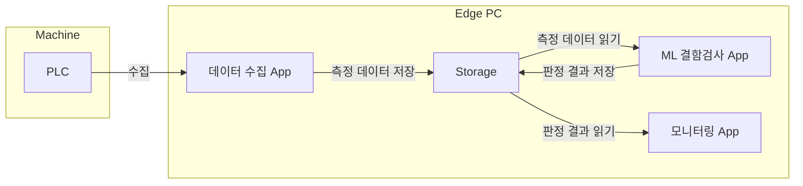

# CLI App 구성도

## App 구성

```mermaid
flowchart LR
    subgraph Machine
        machine[PLC]
    end

    subgraph Edge PC
        cli[ML 결함검사 App]
        collector[데이터 수집 App]
        monitor[모니터링 App]
        storage[Storage]
    end

    machine -->|수집| collector
    collector -->|측정 데이터 저장| storage

    storage -->|측정 데이터 읽기| cli
    cli -->|판정 결과 저장| storage
    

    storage -->|판정 결과 읽기| monitor
```