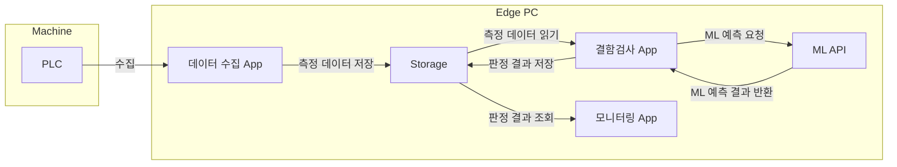

# FastAPI App 구성도

## App 구성

```mermaid
flowchart LR
    subgraph Machine
        machine[PLC]
    end

    subgraph Edge PC
        api[ML API]
        collector[데이터 수집 App]
        detector[결함검사 App]
        monitor[모니터링 App]
        storage[Storage]
    end

    machine -->|수집| collector
    collector -->|측정 데이터 저장| storage

    storage -->|측정 데이터 읽기| detector
    detector -->|ML 예측 요청| api
    api -->|ML 예측 결과 반환| detector
    detector -->|판정 결과 저장| storage

    storage -->|판정 결과 조회| monitor
```