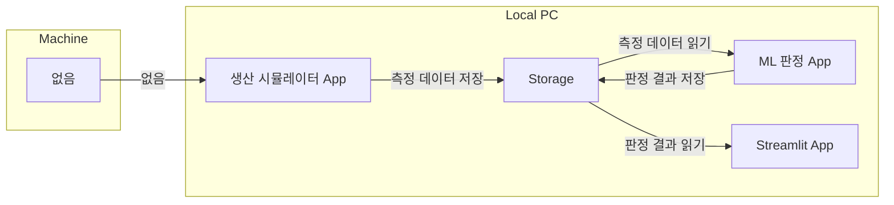
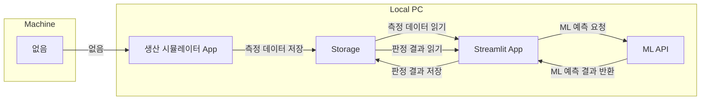

# 데모 App

## 실행 방법
```sh
streamlit run apps/streamlit_app/main.py
```

## CLI 데모 App 구성

```mermaid
flowchart LR
    subgraph Machine
        machine[없음]
    end
    
    subgraph Local PC
        cli[ML 판정 App]
        collector[생산 시뮬레이터 App]
        monitor[Streamlit App]
        storage[Storage]
    end
    machine -->|없음| collector
    collector -->|측정 데이터 저장| storage

    storage -->|측정 데이터 읽기| cli
    cli -->|판정 결과 저장| storage
    

    storage -->|판정 결과 읽기| monitor
```

## FastAPI 데모 App 구성

```mermaid
flowchart LR
    subgraph Machine
        machine[없음]
    end

    subgraph Local PC
        api[ML API]
        collector[생산 시뮬레이터 App]
        detector_monitor[Streamlit App]
        storage[Storage]
    end

    machine -->|없음| collector
    collector -->|측정 데이터 저장| storage

    storage -->|측정 데이터 읽기| detector_monitor
    detector_monitor -->|ML 예측 요청| api
    api -->|ML 예측 결과 반환| detector_monitor
    detector_monitor -->|판정 결과 저장| storage

    storage -->|판정 결과 읽기| detector_monitor
```